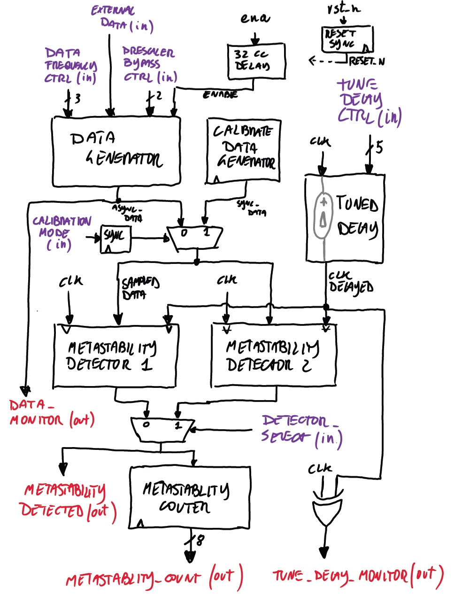
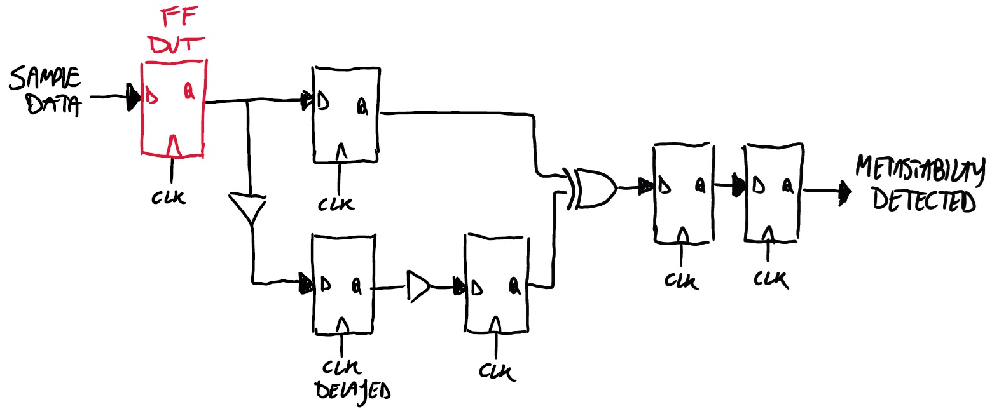
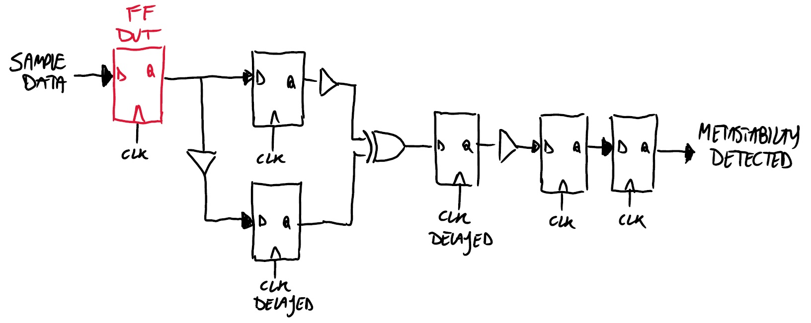

# Luke Meta

**A configurable circuit for generating and measuring flip-flop metastability events using tunable clock skew.**

## How it works

Luke Meta is a metastability characterization circuit. It generates metastability by sampling a locally generated asynchronous data signal.

A metastability detector observes the sampled signals and identifies events. By varying a tunable delay, the circuit adjusts the effective metastability resolution window, allowing detection of events that persist beyond such window. Two selectable implementations of the metastability detector are provided. The selected detector output is counted to provide a measurable indication of metastability activity.

### Block diagram
A cute hand-drawn block diagram of the circuit is shown below. Red signal names denote outputs, purple denote inputs, and black denote internal signals. A small description of the most important blocks is provided in the following. For a detailed description of the input and output signal and timing table see the following sections.

### Data generator

An internal data generator produces an asynchronous signal that is used as the data to be sampled. This is implemented using a configurable ring oscillator.

- A **ring oscillator** built from inverter stages provides a free-running signal.
- The oscillation frequency is adjusted by selecting different feedback tap points (`data_frequency_ctrl`), effectively changing the ring length.
- Optional **division stages** provide lower-frequency versions of the oscillator output.
- A **bypass path** allows selecting between external data, raw oscillator output, or divided signals (`prescaler_bypass_ctrl`).

The generator produces transitions that are not phase-aligned with the system clock, which is essential for exercising metastable conditions.

### Tunable delay

The delay between `clk` and `clk_delayed` is implemented using a selectable inverter-based delay line with multiple tap points. The control signal `tune_delay_ctrl[4:0]` selects one of the available taps along the chain, where each tap corresponds to a different propagation depth through the inverter stages and therefore a different delay. This selection defines the relative phase between `clk` and `clk_delayed`. The delay setting is static during operation and determines the sampling offset used for metastability generation.

### Metastability detectors

Two different detector implementations are provided, each capturing metastability through a slightly different approach. Two more cute hand-drawn circuit diagrams show the detectors' achitecture below.

**Detector 1**  

**Detector 2**  

The active detector is selected via `detector_select`. This allows comparison of detection sensitivity and robustness across implementations.

### Synchronous calibration data

A calibration mode provides a fully synchronous stimulus generated by the `calibrate_data_generator`. This signal is phase-aligned with `clk` and therefore does not produce metastability. It is used to validate correct operation, establish a baseline, and verify that the delay line and detection logic behave as expected under non-violating conditions.

### Output counting

Detected metastability events are accumulated in an internal 8-bit counter. The counter increments on each detected event and exposes the result on `count[7:0]`. The counter wraps around.

### Notes
- After reset or enable release, there is an initialization period of approximately 32 clock cycles before normal operation begins. This allows the inverter chains in both the ring oscillator and the tunable delay line to stabilize.

- All control inputs are pseudo-static and must remain constant during operation. They are not intended to be changed while the system is running, as this may lead to undefined behavior. The only dynamic inputs are the calibration control (which is internally synchronized) and the `external_data` signal when bypass mode is used.

- The ring oscillator is disabled when the tile enable signal is low. This prevents the oscillator from running when the design is not selected, avoiding unnecessary switching activity in cases where power gating is not applied.

## Inputs, Outputs, and Timing

### Inputs

**`data_frequency_ctrl [2:0]`, input**: Controls the internal ring-oscillator in the data generator. This value selects one of the feedback tap lengths inside the oscillator, which changes the ring oscillation frequency. Lower and higher settings therefore select different internal delay paths and produce different asynchronous data rates. See tables below for the specific function and timing.

| `data_frequency_ctrl` | # inv    | Period [ps] | Freq [MHz] | Notes               |
|---------------------|:--------:|:-----------:|:----------:|---------------------|
| `000` (0)           | —        | —           | —          | Ring oscillator off |
| `001` (1)           | 101      | ~5050       | ~198.02    |                     |
| `010` (2)           | 201      | ~10050      | ~99.50     |                     |
| `011` (3)           | 301      | ~15050      | ~66.45     |                     |
| `100` (4)           | 401      | ~20050      | ~49.88     |                     |
| `101` (5)           | 501      | ~25050      | ~39.92     |                     |
| `110` (6)           | 601      | ~30050      | ~33.28     |                     |
| `111` (7)           | 701      | ~35050      | ~28.53     |                     |

**Notes:**
- Estimated delay assumes ~25 ps per inverter stage.
- Actual delay depends on process, voltage, temperature, etc.

**`prescaler_bypass_ctrl [1:0]`, input**: Selects which version of the internally generated data is used. This can be:
  - direct external input bypass,
  - raw ring-oscillator output,
  - divided-by-8 ring output,
  - divided-by-16 ring output.

See tables below for the specific function.

| `prescaler_bypass_ctrl` | Function                                                 |
|-----------------------|----------------------------------------------------------|
| `00` (0)              | External data bypass: `external_data` is routed out      |
| `01` (1)              | Ring oscillator /1: direct output of the ring oscillator |
| `10` (2)              | Ring oscillator /8                                       |
| `11` (3)              | Ring oscillator /16                                      |

**Notes:**
- Selects the source and effective rate of the data signal.
- Bypass mode disables the internal ring oscillator.
- Division stages reduce toggle rate while preserving asynchronous behavior.

**`external_data`, input**: External data input for bypass mode. When the prescaler/bypass control selects bypass, this signal is used directly as the data source instead of the internal ring oscillator path.

**`detector_select`, input**: Selects which metastability detector implementation is connected to the output and counter path. This is intended to switch between detector 1 and 2. 0 selects detector 1, 1 selects detector 2.

**`calibration_mode`, input**: Enables calibration mode. This signal is synchronized internally and causes the detectors to use the synchronous calibration reference path instead of the asynchronous measurement behavior.

**`tune_delay_ctrl [4:0]`, input**: Selects the tap of the tunable delay line that generates the delayed clock used by the detector logic. Internally this chooses one of 32 delay path lenghs along an inverter-chain-based delay path. See tables below for the specific function and timing.

| `tune_delay_ctrl`      | # inv  | Estimated delay [ps] | Notes             |
|------------------------|:------:|:--------------------:|------------------ |
| `00000` (0)            | 0      | ~0                   | Direct connection |
| `00001` (1)            | 30     | 750                  |                   |
| `00010` (2)            | 60     | 1500                 |                   |
| `00011` (3)            | 90     | 2250                 |                   |
| `00100` (4)            | 120    | 3000                 |                   |
| `00101` (5)            | 150    | 3750                 |                   |
| `00110` (6)            | 180    | 4500                 |                   |
| `00111` (7)            | 210    | 5250                 |                   |
| `01000` (8)            | 240    | 6000                 |                   |
| `01001` (9)            | 270    | 6750                 |                   |
| `01010` (10)           | 300    | 7500                 |                   |
| `01011` (11)           | 330    | 8250                 |                   |
| `01100` (12)           | 360    | 9000                 |                   |
| `01101` (13)           | 390    | 9750                 |                   |
| `01110` (14)           | 420    | 10500                |                   |
| `01111` (15)           | 450    | 11250                |                   |
| `10000` (16)           | 480    | 12000                |                   |
| `10001` (17)           | 510    | 12750                |                   |
| `10010` (18)           | 540    | 13500                |                   |
| `10011` (19)           | 570    | 14250                |                   |
| `10100` (20)           | 600    | 15000                |                   |
| `10101` (21)           | 630    | 15750                |                   |
| `10110` (22)           | 660    | 16500                |                   |
| `10111` (23)           | 690    | 17250                |                   |
| `11000` (24)           | 720    | 18000                |                   |
| `11001` (25)           | 750    | 18750                |                   |
| `11010` (26)           | 780    | 19500                |                   |
| `11011` (27)           | 810    | 20250                |                   |
| `11100` (28)           | 840    | 21000                |                   |
| `11101` (29)           | 870    | 21750                |                   |
| `11110` (30)           | 900    | 22500                | Maximum delay     |
| `11111` (31)           | —      | —                    | Inverted input    |

**Notes:**
- Estimated delay assumes ~25 ps per inverter stage.
- Actual delay depends on process, voltage, temperature, etc.

### Outputs

**`metastability_detected`, output**: Real-time output from the selected detector. This signal indicates that the active detector has flagged a metastability event. It is also the signal that drives the event counter.

**`data_monitor`, output**: Monitor copy of the internal data signal being used for the experiment. This output is provided for observation of the actual stimulus data, whether it comes from the internal generator or external bypass selection.

**`tune_delay_monitor`, output**: Monitor output for the delay line. This is implemented as `clk_delayed XOR clk`, so it does not expose the delayed clock directly. Instead it produces a pulse-width or phase-difference indicator that can be measured externally to estimate the effective selected delay.

**`metastability_count [7:0]`, output**: Running count of detected metastability events. This counter increments when the selected detector asserts `metastability_detected` and provides the main quantitative output of the circuit.

## How to use

Configure the control inputs to select the desired data source, data rate, delay setting, and detector implementation. The primary output of interest is `metastability_count`, which reflects the number of detected events under the chosen configuration. By running experiments across different data rates and delay settings, the circuit can be used to characterize metastability-related parameters of the flip-flop under test.

